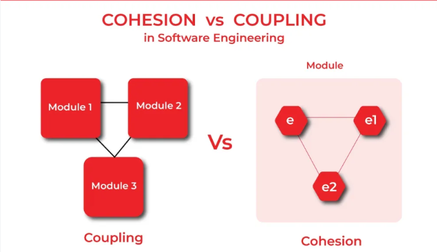

<h3>A Daily Practice of Empirical Software Design - Kent Beck - DDD Europe 2023</h3>

Kent Beck อธิบายแนวคิดพื้นฐานของ software design โดยเน้นที่ Coupling และ Cohesion ซึ่งเป็นแนวคิดจากหนังสือ Structured Design

Coupling คือความสัมพันธ์ระหว่าง elements สองตัว (E1 และ E2) ที่ถ้าเราเปลี่ยน E1 เราจะต้องเปลี่ยน E2 ด้วย โดย coupling นี้ขึ้นอยู่กับการเปลี่ยนแปลงเฉพาะเจาะจง (specific change) เช่น ถ้าเปลี่ยนชื่อ function ที่ถูกเรียกใช้ ก็ต้องไปเปลี่ยนที่ caller ด้วย แต่ถ้าเปลี่ยนแค่ formatting (spaces/tabs) ก็ไม่จำเป็นต้องเปลี่ยน caller ดังนั้น coupling จึงไม่สามารถวิเคราะห์แบบ static ได้ เพราะต้องดูว่าเรากำลังจะทำการเปลี่ยนแปลงอะไร

Kent ยกตัวอย่างจาก Facebook ที่มี services สองตัวอยู่ใน rack เดียวกัน เมื่อหนึ่งใน service เปลี่ยนวิธี backup จาก incremental backups รายวันเป็น big backups รายสัปดาห์ ทำให้อีก service หนึ่งล้มเหลว เพราะ network switch มี bandwidth จำกัด สองทีมนี้ไม่รู้จักกันด้วยซ้ำ แสดงให้เห็นว่า coupling สามารถซ่อนอยู่ในที่ที่ไม่คาดคิด

นอกจากนี้ เครื่องมือ (tools) ก็มีผลต่อ coupling ด้วย ถ้ามี automated refactoring เช่นใน Eclipse เราสามารถเปลี่ยนชื่อ function ที่ถูกเรียกใช้หลายพันครั้งได้ในคลิกเดียว ทำให้ function เหล่านั้นไม่ coupled กับชื่อ function อีกต่อไป

Cohesion คือ element ที่มี sub-elements ที่ coupled กัน ถ้า sub-elements ใน element เดียวกัน coupled กันอยู่แล้ว มันดีกว่าการที่ coupling กระจายอยู่คนละ file หรือคนละ directory เพราะยิ่ง coupling กระจายตัวมากเท่าไหร่ ค่าใช้จ่ายในการเปลี่ยนแปลงก็ยิ่งสูงขึ้น การเพิ่ม cohesion คือการรวม elements ที่ coupled กันไว้ใกล้ๆ กัน ทำให้ลดต้นทุนในการเปลี่ยนแปลง

ช่วงเวลา: 23:00 - 43:25 นาที
YouTube : [A Daily Practice of Empirical Software Design - Kent Beck](https://www.youtube.com/watch?v=yBEcq23OgB4)
